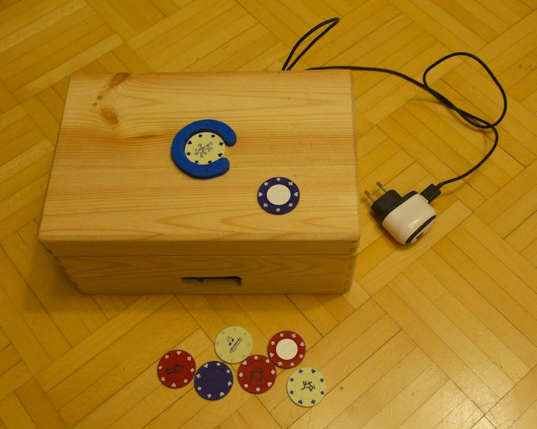
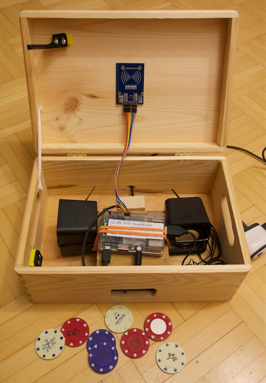
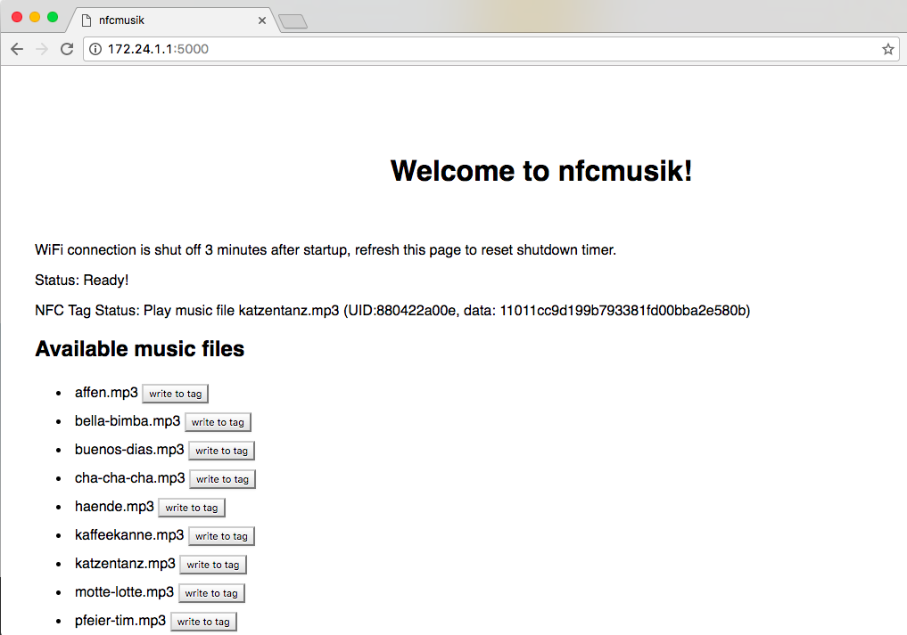

# nfcmusik

**This branch** differs from the master branch as follows:
- Don't configure Pi as local access point, hook it into the home WiFi (this needs to be done manually during initial setup)
- Run with Python3 (link `/usr/bin/python` to `/usr/bin/python3` manually, if needed!)
- Extend functionality
  - Play web radio for kids
  - Announce the time
  - ...
  

**Goal:** build a simple mp3 player that a toddler can use, based on a raspberry pi.

A song is started by placing an NFC token on a sensor. Removing the token stops the music.
That's all the user interface there is.

In my setup, the RasPi is hidden in a wooden box, that also contains a pair of tiny USB speakers.
The NFC sensor is screwed to the inside of the lid. 
As tokens I use plastic poker chips. Each token plays one specific song.
On one side I stick an NFC tag, on the other I draw a little icon
symbolizing the song to be played by this token.





The music box is configured via a web interface, in which you can assign a song to 
a specific NFC tag. 



## Shopping list

Here's what I bought to build the player (no, I'm in no way affiliated with Amazon...):

- [Neuftech Mifare RC522 RFC Reader](https://www.amazon.de/gp/product/B00QFDRPZY/)
- [Trust Leto 2.0 USB Speakers](https://www.amazon.de/gp/product/B00JRW0M32/)
- [20 NFC Tags Sticker NTAG213 Circus round 22mm 168Byte](https://www.amazon.de/gp/product/B00BTKAI7U/)
- Some USB power supply, plus a USB extension cable
- [Aukru 40x 20cm female-female jumper wire](https://www.amazon.de/gp/product/B00OL6JZ3C/) to wire the RFC reader to the RasPi
- [Raspberry Board Pi 3 Model B](https://www.amazon.de/gp/product/B01CCOXV34/)
- Some SD Card (16 GB)
- Some RasPi Case
- A wooden box, about the size of a shoe box, from a DIY store

## Raspberry Pi Setup

There are three ways documented below to provision your RPi:

- Fully-automatic build which generates a Rasbian-alike image with system packages installed and the RPi configured as a WIFI access point;
- Semi-automatic build, in case you already have a Pi running and just want to get the requirements installed properly on your Pi;
- Manual setup which gives you the bits necessary to configure your RPi.

What is left afterwards, though, is the setup of the _nfcmusik_ service itself.
See the section on the _Software Setup_ for this purpose. 

### Fully-Automatic Build (Vagrant + Virtualbox)

Recommended way of building _nfcmusik_ is to use the `build-image` make target.

```
make build-image
```

This target produces `build/nfcmusik-rpi-arm.img`, ready to be flashed onto an SD card via

```
make flash
```

In order to make this work, you need to have the following tools installed:

- [Vagrant](https://www.vagrantup.com) in a recent version (tested with 2.2.5)
- [Virtualbox](https://www.virtualbox.org) in a recent version (tested with 6.0.12)

### Semi-Automatic Build (Ansible)

Suitable if you already have a Raspberry Pi running and accessible over ssh from within your network.
It utilizes Ansible to configure your Pi as a Wifi Access Point, configures DHCP, and ensures the SPI (serial-parallel interface) is enabled:

```
ansible-playbook setup/ansible/nfcmusik.yml --inventory <rpi-ip>, --diff -e ansible_user=<rpi-user> --ask-pass 
```

in case you authenticate via username/password (btw: yes, the *comma* is indeed intended and even required), or

```
ansible-playbook setup/ansible/nfcmusik.yml --inventory <rpi-ip>, --diff
```

in case of ssh-key-based authentication.

In order to make this work, you need to have the following tools installed:

- Python 3 (tested with Python 3.7)
- [Ansible](https://www.ansible.com) (tested with Ansible 2.8)

### Manual Setup

### Initial headless WiFi configuration

If you have neither a keyboard and screen available, nor an Ethernet cable and router, you can configure your Pi
to connect to you local WiFi by editing files on the SD Card.
Follow [these instructions](https://raspberrypi.stackexchange.com/a/57023) to do so.
After booting, your Pi should be accessible by `ssh pi@raspberrypi` from the terminal.

### Wifi Access Point

Configure the RPi to act as a WLAN access point on interface `wlan0`. 
See, for example, [this site](https://frillip.com/using-your-raspberry-pi-3-as-a-wifi-access-point-with-hostapd/) for instructions.
Note the static IP that you assign to the RasPi while configuring. This will be the address where
you can access the user interface (also see below).

The `wlan0` interface is automatically shut down 3 minutes after startup, to avoid unneccessary 'radiation' and
to reduce interference in the speakers. Refreshing the home page of the user interface resets
the shutdown timer. After the access point has shut down, you would need to re-boot the RasPi to 
reconnect (or connect to it via LAN).

### Base OS

The code was built and tested with Raspbian Jessie (2016-05-27).
Enable the SPI interface using `sudo raspi-config`, then go to `Advanced Options` and enable SPI.

Alternatively, you can also flash a [hypriot image](https://blog.hypriot.com) (Raspbian Buster including a working installation of docker) by use of the [hypriot flash](https://github.com/hypriot/flash) utility.
The configuration files used in this process are located under `setup/image`.
To use it to flash an sd card, just run

```
make flash
```

and follow the prompts.
No worries about enabling interfaces anymore. :)

### System packages

Install these via `sudo apt-get install <package>`, after doing `sudo apt-get upgrade`
* python-dev (required for building SPI driver)

Optional:
* vim
* ipython

## Software setup

After the build you still need to setup the _nfcmusik_ service.

### Python packages

The easiest way to get all the packages you need is to use [pipenv](https://pipenv.readthedocs.io/en/latest/).
If not already installed on your system, you can get it via

```
pip install pipenv
```

Once installed, you can get all the project's required packages nicely installed in a virtual env by executing the following command:

```
pipenv install --three
``` 

Finally, get into the virtual env via

```
pipenv shell
```

## Integrated third-party code for RFID interface

The **RFID interface** (`rfid.py`) is based on [pi-rc522](https://github.com/ondryaso/pi-rc522), commit 
[`6f5add08df29940bac15d3e9d98763fcc212ecc7`](https://github.com/ondryaso/pi-rc522/tree/6f5add08df29940bac15d3e9d98763fcc212ecc7), with custom modifications.

## NFC Tags

This project was built and tested with NXP NTAG213 tags. Contrary to the examples
and default usage in `rfid.py`, these do NOT require authentication
to be read or written. They also use 4-byte pages instead of 16-byte ones.
`read`s return 4 pages (16 bytes) at a time, but writes write 4 bytes only.
`rfid.py` can read 16 bytes fine, writes must happen with 16 bytes of data
of which only the first 4 are actually written.

*ToDo*: Fix `rfid.py` to correctly handle 4-byte writes..

## NFC Reader

See [the pi-rc522 page](https://github.com/ondryaso/pi-rc522) for instructions on how to connect the NFC reader to your RasPi.
The RasPi pinout can be found [here](http://pinout.xyz/).

## Administration

Copy mp3 files to the RasPi SD Card, adapt `settings.py` to point to the correct `MUSIC_ROOT`
containing the mp3 files.
Copying can be done via `scp` or by plugging the SD card into your PC/Mac.
Music files contained in `MUSIC_ROOT` will be shown in the user interface and will
be playable by NFC tags.

Clone this git repo into a directory of your choice on the RasPi. Run `python controller.py` to start. 
See comment in `controller.py` for how to autostart on reboot.

Open `http://<RasPi IP or host name>:5000` to access NFC tag management.
Place tag on reader, click 'write to tag' besides one of the listed music files
to assign the file to the tag.
